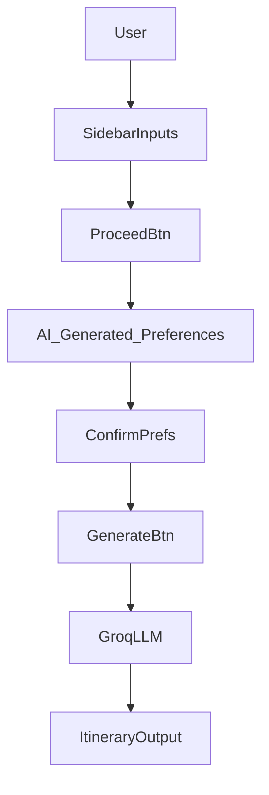

# 🌍 AI-Powered Travel Planner ✈️🗺️

An intelligent Streamlit-based travel planner that creates fully personalized itineraries using user inputs and the Groq LLM (LLaMA3). This app helps users plan their travel effortlessly, including hotel suggestions, attractions, time allocation, and more!


---

## 🚀 Features

- 🧠 **Interactive User Preferences**
- 🗂️ **Structured Additional Preferences via LLM**
- 🕒 **Itinerary with Timings, Meals, Travel Durations**
- 🏨 **Hotel + Restaurant Recommendations**
- 🌐 **LLaMA3 Integration via Groq API**
- 📱 **Streamlit Interface**

---

## 🧠 App Flow



---

## 📂 File Structure

```
travel_planner/
├── main.py             # Main Streamlit app
├── .env                # API Keys (Groq)
└── requirements.txt    # Python dependencies
```

---

## 🛠️ Tech Stack

- **Streamlit** – UI framework  
- **Groq API (LLaMA3)** – Language model for generation  
- **Python 3.11+** – Core language  
- **datetime, os** – Standard libraries for logic  
- **.env** – Key management

---

## ⚙️ Setup Instructions

### 1. Clone the Repo

```bash
git clone https://github.com/yourusername/travel-planner-ai
cd travel-planner-ai
```

### 2. Install Dependencies

```bash
pip install -r requirements.txt
```

### 3. Add API Key

Create a `.env` file:

```env
GROQ_API_KEY=your_api_key_here
```

### 4. Run the App

```bash
streamlit run main.py
```

---

## 🎯 Example Output

> Destination: Paris  
> Start Date: 2025-06-01 to 2025-06-07  
> Budget: Mid-range  
> Interests: Cultural, Food  
> Preferences: Boutique Hotel, Metro Travel, Local Dining

🗓️ **Day 1**: Eiffel Tower, Seine River Cruise, French Bistro Lunch...  
🗓️ **Day 2**: Louvre Museum, Street Café, Montmartre Evening...  
...

---

## 👩‍💻 Built By

**Aishwarya** – Turning AI into your travel buddy.  
🔗 [LinkedIn](https://linkedin.com/in/aishwaryabojja)
